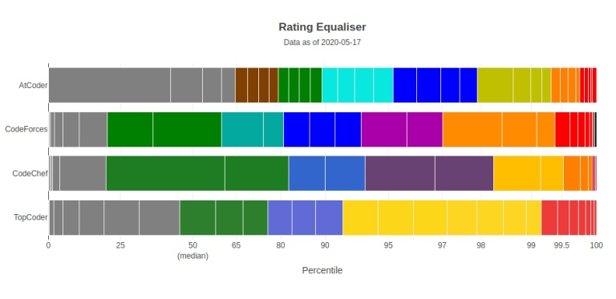

# Choi SuHwan / MilkClouds

## 🙋‍♂️ Profile

* Choi SuHwan / MilkClouds
* Seoul National University Undergraduate - Majoring Physics
* Interest: Machine Learning, Quantum Computing, Homomorphic Encryption(Post Quantum Cryptography), Blockchain(Smart Contract, DeFI, ...), SMR(+Nuclear Fusion), BCI, etc...

+ 2021
    + Software Maestro 12th
    + Studied Deep Learning, Basic of Quantum Computing, Basic of Blockchain
    + [PR](https://github.com/open-mmlab/mmdetection3d/pull/1050) merged for openmmlab/mmdetection3d
    + [PR](https://github.com/isac322/BOJ-auto_code_downloader/pull/3) merged for isac322/BOJ-auto_code_downloader

## 💻 Online Judge

* BOJ: [milkclouds](http://icpc.me/milkclouds)
  * solvedac: [milkclouds](https://solved.ac/profile/milkclouds)
 * AtCoder: [MilkClouds](https://atcoder.jp/users/MilkClouds) 
<!-- * Codeforces: [MilkClouds](https://codeforces.com/profile/MilkClouds)  -->

<!--  -->

## 💬 Website

* [Worldpad](https://milkclouds.work/)
~~* [Something like Blog](https://milkclouds.github.io) (Jekyll blog, outdated)~~
~~* [Notepad](https://milkclouds.notion.site/Notepad-1844a1560b794594829770ee5b49bdb7) (Notion blog, outdated)~~

## 🏷️ Cards

<!--  -->

<!--  -->

 

### Frequently Used       
   

### Used at Least Once Anyway...
     

## 📫 Contacts

* milkclouds@snu.ac.kr

