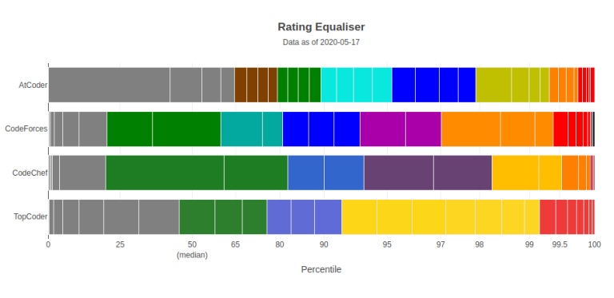

# Suhwan Choi / MilkClouds

## 🙋‍♂️ Profile

* Suhwan Choi / MilkClouds
* Research Profile page: https://suhwanchoi.me/, [CV](https://suhwanchoi.me/data/suhwan_choi_cv.pdf)
* Personal blog: https://milkclouds.work

<!--
## 💻 Online Judge

* BOJ: [milkclouds](http://icpc.me/milkclouds)
  * solvedac: [milkclouds](https://solved.ac/profile/milkclouds)
  * AtCoder: [MilkClouds](https://atcoder.jp/users/MilkClouds) 
-->

<!-- * Codeforces: [MilkClouds](https://codeforces.com/profile/MilkClouds)  -->

<!--  -->

## 🏷️ Cards

<!--  -->
<!--  -->

<!--  -->

 

<!--  -->

## Some open-source projects

- https://github.com/MilkClouds/lazyregistry: A lightweight Python library for lazy-loading registries with namespace support and type safety
- https://github.com/MilkClouds/smon: Real-time Slurm cluster monitoring tool with interactive TUI with Textual. Visualizes GPU/CPU/memory allocation across nodes with job-level drill-down.
- https://github.com/MilkClouds/vla0-trl: Unofficial reimplementation of VLA-0 using TRL's SFTTrainer.
    - While common VLA codebases are over 10,000 lines, vla0-trl contains only ~1,200 lines total. Gets ~90% on LIBERO by just fine-tuning Qwen2.5-VL to predict actions as text. No custom architecture needed.
- https://github.com/MilkClouds/SimpleRPyC: SimpleRPyC (pronounced simple-are-pie-see), short for Simple Remote Python Call, is a WebSocket-based RPC library for Python. Inspired by RPyC, it uses transparent proxy objects to let you interact with remote Python objects as if they were local—leveraging Python's dynamic nature to bridge processes and machines seamlessly. Additionally, SimpleRPyC provides convenient module patching that allows you to use existing code with minimal changes.
- https://github.com/open-world-agents
