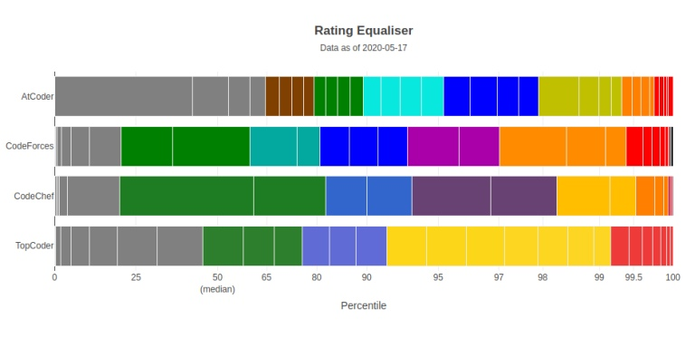

# Suhwan Choi / MilkClouds

## 🙋‍♂️ Profile

* Suhwan Choi / MilkClouds
* Research Profile page: https://suhwanchoi.me/, [CV](https://suhwanchoi.me/data/suhwan_choi_cv.pdf)
* Personal blog: https://milkclouds.work

<!--
## 💻 Online Judge

* BOJ: [milkclouds](http://icpc.me/milkclouds)
  * solvedac: [milkclouds](https://solved.ac/profile/milkclouds)
  * AtCoder: [MilkClouds](https://atcoder.jp/users/MilkClouds) 
-->

<!-- * Codeforces: [MilkClouds](https://codeforces.com/profile/MilkClouds)  -->

<!--  -->

## 🏷️ Cards

<!--  -->
<!--  -->

<!--  -->

 

<!--  -->

## Open-source projects

Selected developer tools, libraries, and research projects. ⭐ marks featured work; 💎 marks niche tools with outsized value for the right users.

<!-- Sort project tables by marker first, then stars descending, then repository name alphabetically. -->

### 🧭 Development setup & workflow

**[my-dev-playbook](https://github.com/MilkClouds/my-dev-playbook)**  — Personal guide to shells, tools, editors, AI agents, HPC, and development workflows.

### 🛠️ Developer tools & libraries

| Project | Stars | Description |
| --- | :---: | --- |
| ⭐ **[paperstack](https://github.com/MilkClouds/paperstack)** |  | CLI to curate, query, and publish independent research corpora. |
| ⭐ **[smon](https://github.com/MilkClouds/smon)** |  | Textual TUI for real-time Slurm resource monitoring with job-level drill-down. |
| 💎 **[lazyregistry](https://github.com/MilkClouds/lazyregistry)** |  | Lightweight Python library for lazy-loading registries with namespace support and type safety. |
| 💎 **[chrono-daemon](https://github.com/MilkClouds/chrono-daemon)** |  | Tiny AnyIO runtime for time-driven async daemon graphs. |
| **[fetch-bib](https://github.com/MilkClouds/fetch-bib)** |  | Claude Code skill for human-in-the-loop BibTeX retrieval from authoritative sources. |
| **[SimpleRPyC](https://github.com/MilkClouds/SimpleRPyC)** |  | WebSocket RPC for Python with transparent remote-object proxies and drop-in module patching. |
| **[md-render](https://github.com/MilkClouds/md-render)** |  | Render a local Markdown file or GitHub URL as a GitHub-styled PDF or standalone HTML document. |
| **[pycodelift](https://github.com/MilkClouds/pycodelift)** |  | Framework-agnostic build-time flattener for Python class hierarchies, extending Transformers' modular code generation. |

### 🔬 Research & resources

| Project | Stars | Description |
| --- | :---: | --- |
| ⭐ **[allenai/vla-evaluation-harness](https://github.com/allenai/vla-evaluation-harness)** |  | One framework to evaluate any VLA model on any robot simulation benchmark. |
| ⭐ **[awesome-vla-study](https://github.com/MilkClouds/awesome-vla-study)** |  | Reading-ordered VLA paper guide spanning generative foundations, architectures, data scaling, RL, and world models. |
| ⭐ **[vla0-trl](https://github.com/MilkClouds/vla0-trl)** |  | ~1,200-line VLA-0 reimplementation reaching ~90% on LIBERO by predicting actions as text with Qwen2.5-VL—no custom architecture. |
| **[open-world-agents/open-world-agents](https://github.com/open-world-agents/open-world-agents)** |  | Everything needed to build state-of-the-art foundation multimodal desktop agents end to end. |
| **[do-custom-kernels-matter](https://github.com/MilkClouds/do-custom-kernels-matter)** |  | Measures whether custom kernels materially improve end-to-end inference beyond static cache, CUDA graphs, and `torch.compile` baselines. |
